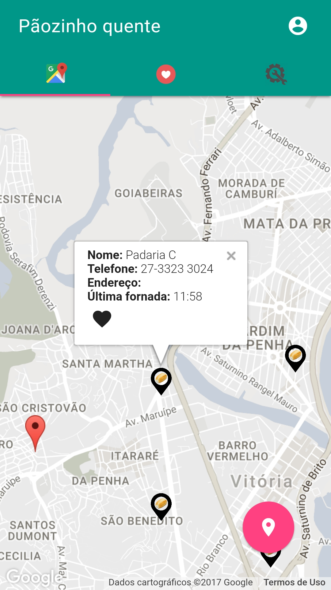
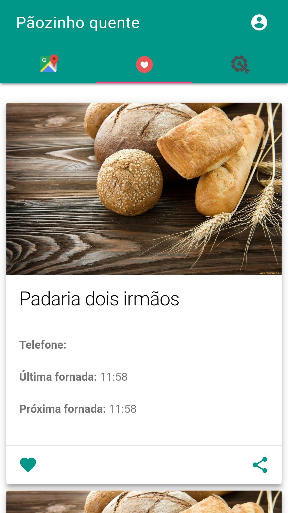
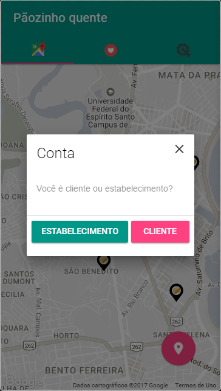
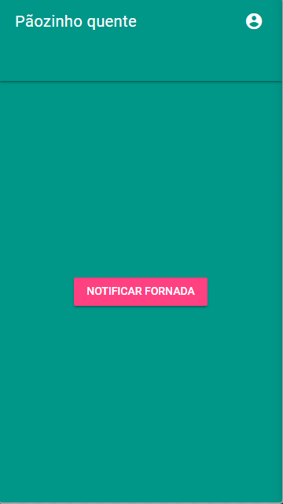
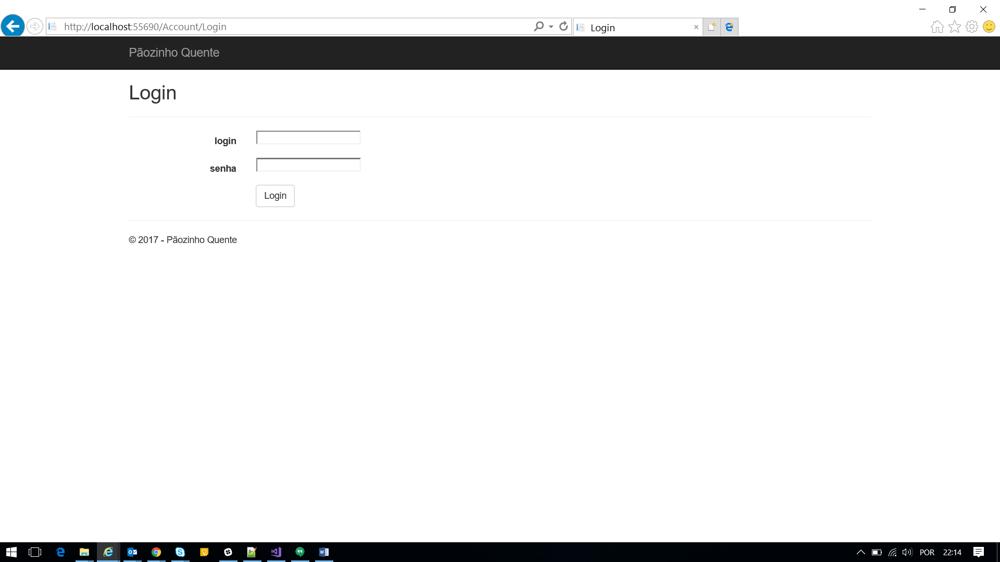
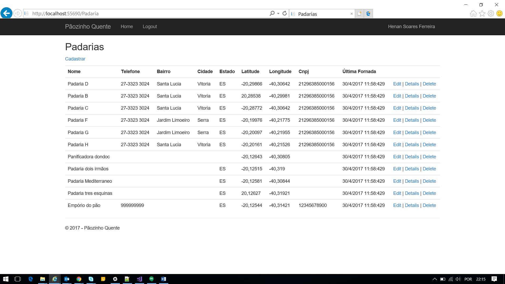
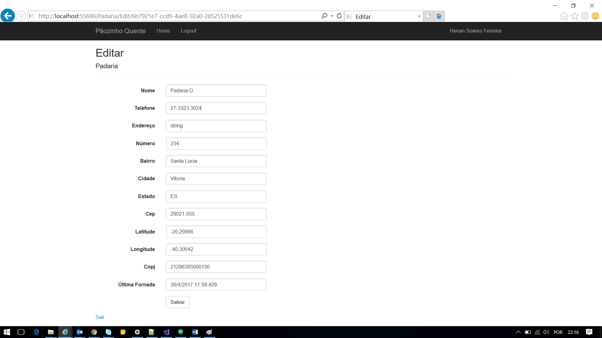
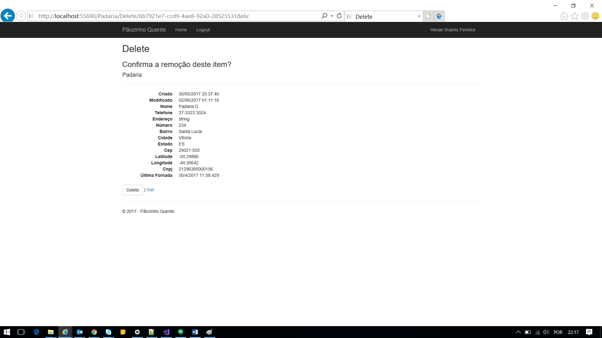
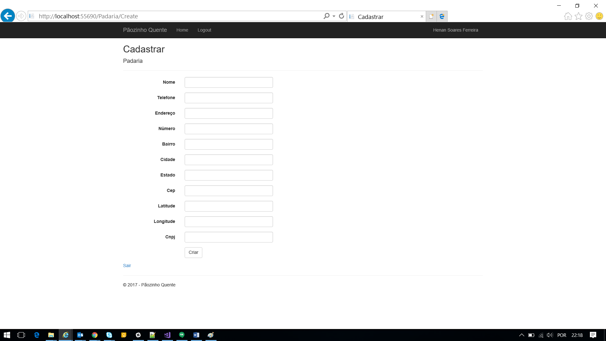

# PaozinhoQuente
Aplicação mobile construído em atendimento à disciplina de TCC-2 da Faculdade do Centro Leste - Período 2017/01.

Aplicativo que auxilie o consumidor na localização de padarias, além de informar o horário de fornadas de pão em cada uma das padarias cadastradas. O aplicativo mostra a localização das padarias por posicionamento geográfico, levando em consideração o posicionamento da localidade onde o usuário se encontra. Com a localização do usuário, o aplicativo mostra na tela do celular, onde estão todas as padarias cadastradas em um perímetro determinado. Além disso, também mostra o horário de fornadas de pão na padaria selecionada pelo usuário.

## Sumário

* [Instalação](#instalacao)
* [Protótipos](#prototipos)
* [Autores](#autores)
* [Orientador](#orientador)

##  Instalação

Habilitar fontes desconhecidas do android:

* **Configurações** > **Segurança** > **Fontes desconhecidas** - Permitir a instalação de aplicativos que não são do android Market

##  Protótipos

##  Autores

* **Henan Soares Ferreira** - *Desenvolvedor/Analista de Requisitos* - <hsferreira@gmail.com>
* **Wesley Moreira Pereira** - *Desenvolvedor/Analista de Requisitos* - <wemoreno10@gmail.com>

##  Orientador

* **Edgar Eler** - *Professor  do curso de Sistemas de Informação* - <edgareler@ucl.br>
